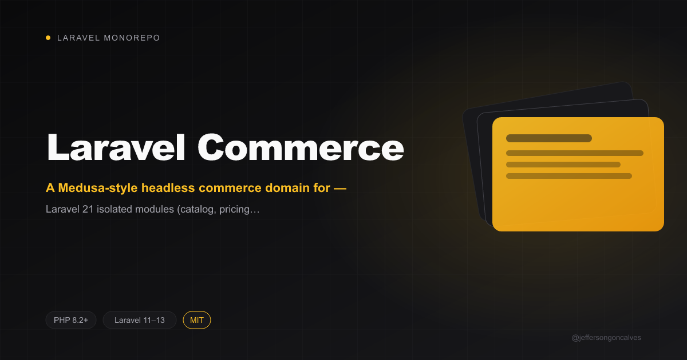

<p align="center"></p>

# Laravel Commerce

[](https://packagist.org/packages/jeffersongoncalves/laravel-commerce) [](https://packagist.org/packages/jeffersongoncalves/laravel-commerce) [](LICENSE.md)

A Medusa-style headless commerce domain for Laravel — catalog, pricing, inventory, cart, order, payment, fulfillment, tax, promotions and more, organized under one `src/` tree, plus a saga-based checkout workflow engine.

## Requirements

- PHP 8.2+
- Laravel 11, 12, or 13

## Installation

```bash
composer require jeffersongoncalves/laravel-commerce
```

`CommerceServiceProvider` is auto-discovered — no manual registration needed.

### Publish configuration

```bash
php artisan vendor:publish --tag=laravel-commerce-config
```

This publishes a single `config/commerce.php` with the default currency and each domain's table name.

### Run migrations

```bash
php artisan migrate
```

## Domain modules

Everything lives under `src/`, one namespace per domain, sharing a single `CommerceServiceProvider`:

| Module | Responsibility |
|---|---|
| `Store`, `SalesChannel`, `Region` | Store, sales channel, and region/country setup |
| `Currency` | Currencies and default currency resolution |
| `User`, `Auth`, `ApiKey` | Users, auth identities/providers, publishable & secret API keys |
| `Product` | Products, variants, options, categories, collections, tags |
| `Pricing` | Price sets, price lists, price rules |
| `Inventory`, `StockLocation` | Inventory items/levels, reservations, stock locations |
| `Customer` | Customers, groups, addresses |
| `Cart`, `Checkout` | Cart line items, shipping methods, checkout saga |
| `Order` | Order lifecycle, returns, exchanges, claims, transactions |
| `Payment` | Payment collections, sessions, captures, refunds |
| `Fulfillment` | Fulfillment sets, service zones, shipping options |
| `Tax` | Tax regions and rates |
| `Promotion` | Campaigns, promotions, promotion rules, application methods |
| `Loyalty`, `StoreCredit` | Loyalty accounts/transactions, store credit accounts/transactions |
| `Translation` | Translatable content |
| `Storefront`, `Admin` | Headless Store API and Admin API controllers |

## Usage

### Services

Every domain exposes a `Service` (e.g. `ProductService`, `CartService`, `OrderService`) with generic CRUD ergonomics:

```php
use JeffersonGoncalves\Commerce\Product\Services\ProductService;

$service = app(ProductService::class);

$product = $service->create(['title' => 'T-Shirt', 'status' => 'published']);
$product = $service->retrieve($product->id);
$service->update($product->id, ['title' => 'Cotton T-Shirt']);
$products = $service->list(['status' => 'published']);
$service->delete($product->id);
```

### Checkout saga

`CheckoutService::complete()` converts a cart into an order by running an ordered `Workflow` of `Step`s (reserve inventory, create order, create line items, ...). If any step fails, prior steps are compensated in reverse order and a `WorkflowException` is thrown — no distributed transaction needed:

```php
use JeffersonGoncalves\Commerce\Checkout\Services\CheckoutService;

$order = app(CheckoutService::class)->complete($cart->id);
```

Returns, exchanges, and order edits (`ReturnWorkflow`, `ExchangeWorkflow`, `OrderEditService`) follow the same saga pattern.

### Money

Amounts are integers in the currency's minor units (e.g. cents), never floats:

```php
use JeffersonGoncalves\Commerce\Core\Support\Money;

$price = Money::of(1999, 'usd');
$total = $price->add(Money::of(500, 'usd')); // 2499 usd
```

### Prefixed IDs

Models using the `HasPrefixedId` trait get non-incrementing ULID primary keys prefixed with a type token, e.g. `prod_01J...`, `order_01J...`.

## Headless APIs

### Store API (`/store/*`)

Requires header `x-publishable-api-key: <token>` (an `ApiKey` with `type: publishable`).

| Method | Endpoint | Description |
|---|---|---|
| GET | `/store/products` | List products |
| POST | `/store/carts` | Create a cart |
| POST | `/store/carts/{cart}/line-items` | Add a line item |
| POST | `/store/carts/{cart}/complete` | Run the checkout saga |
| GET | `/store/orders/{order}` | Show an order |

### Admin API (`/admin/commerce/*`)

Requires `Authorization: Bearer <token>` or header `x-api-key: <token>` (an `ApiKey` with `type: secret`).

| Method | Endpoint | Description |
|---|---|---|
| GET | `/admin/commerce/products` | List products |
| POST | `/admin/commerce/products` | Create a product |
| GET | `/admin/commerce/products/{product}` | Show a product |
| PATCH | `/admin/commerce/products/{product}` | Update a product |
| DELETE | `/admin/commerce/products/{product}` | Delete a product |
| GET | `/admin/commerce/orders` | List orders |
| GET | `/admin/commerce/orders/{order}` | Show an order |
| POST | `/admin/commerce/orders/{order}/returns` | Register a return |
| POST | `/admin/commerce/orders/{order}/items` | Edit order items |

Both API key types can be managed through `ApiKeyService`.

## Events

Domain actions dispatch events you can listen to in your application, e.g. `OrderPlaced` (after checkout completes), `PaymentCaptured`, `ReturnReceived`.

## Testing

```bash
composer test
```

## Static Analysis

```bash
composer analyse
```

## Code Formatting

```bash
composer format
```

## License

The MIT License (MIT). Please see [License File](LICENSE.md) for more information.
