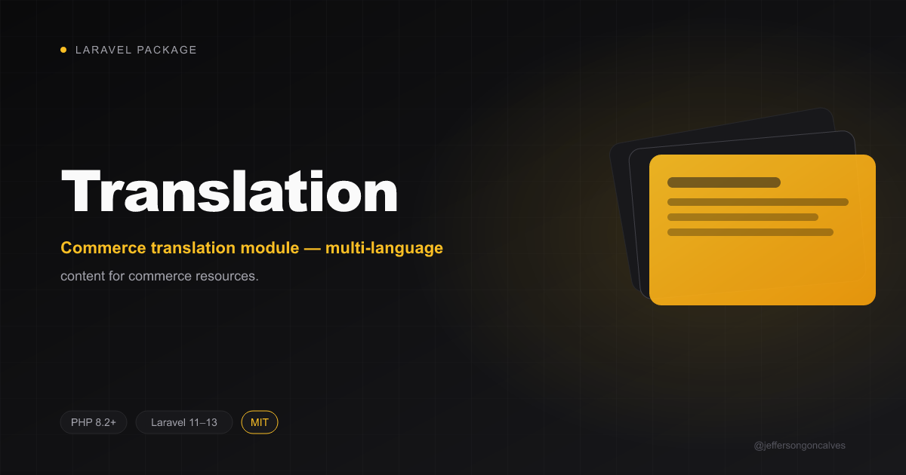

<p align="center"></p>

# Translation

[](https://packagist.org/packages/jeffersongoncalves/laravel-commerce-translation) [](https://packagist.org/packages/jeffersongoncalves/laravel-commerce-translation) [](LICENSE.md)

Commerce translation module — multi-language content for commerce resources.

## Installation

```bash
composer require jeffersongoncalves/laravel-commerce-translation
```

## Usage

The service provider is auto-discovered. Publish migrations and use the module models and services directly. See the [umbrella package](https://github.com/jeffersongoncalves/laravel-commerce) for the full ecosystem.

## License

The MIT License (MIT). Please see [License File](LICENSE.md) for more information.
